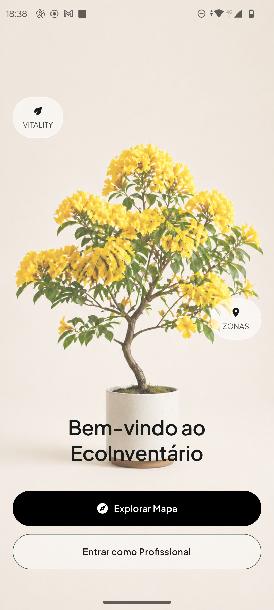
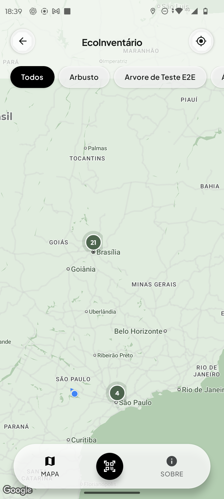
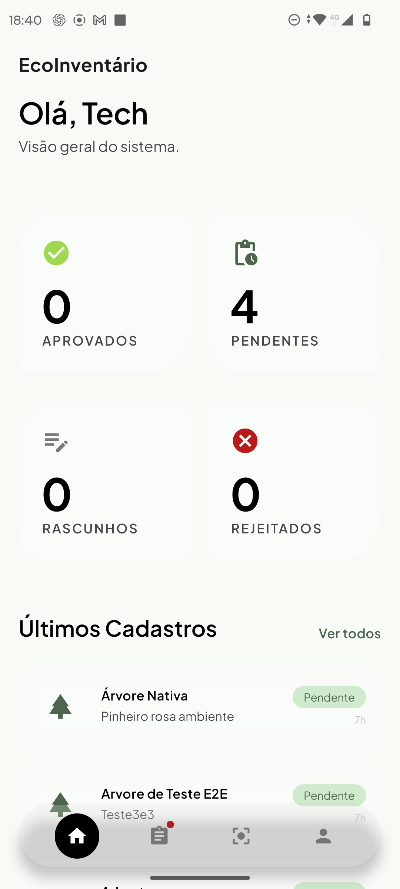
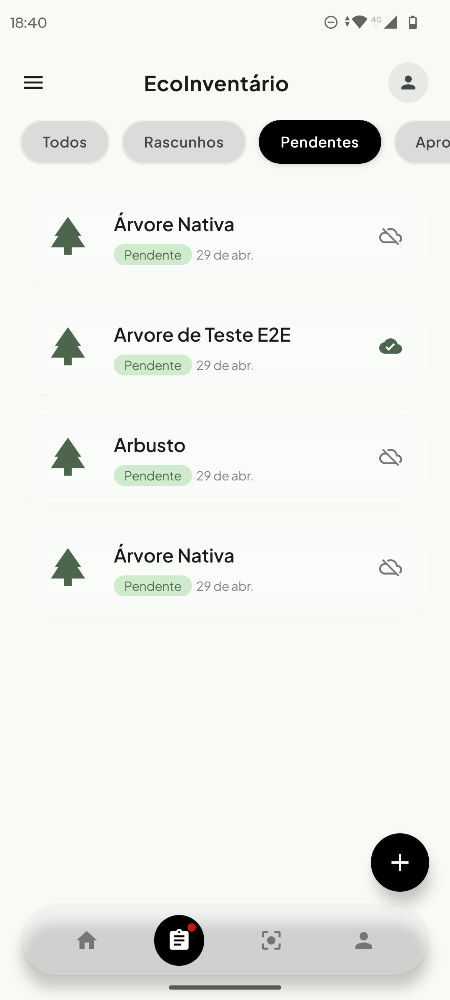
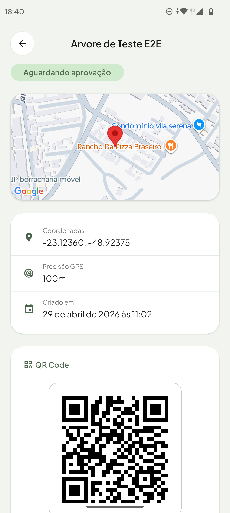
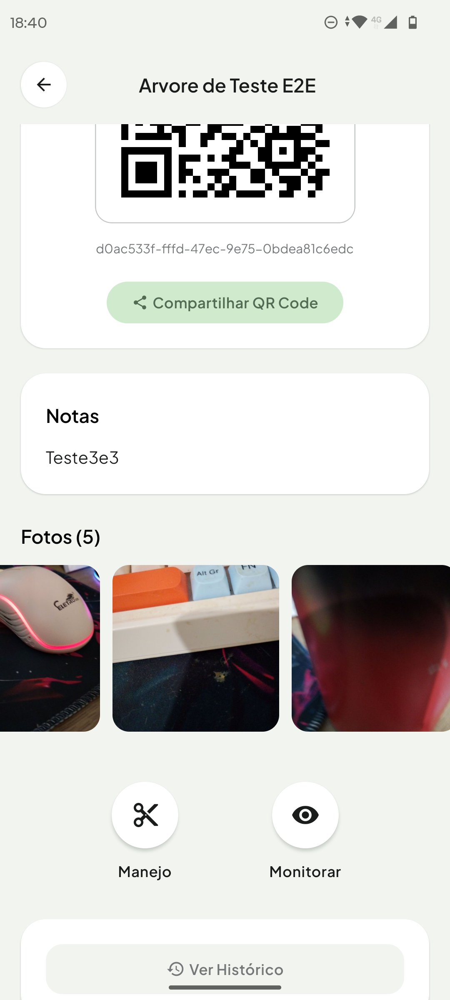
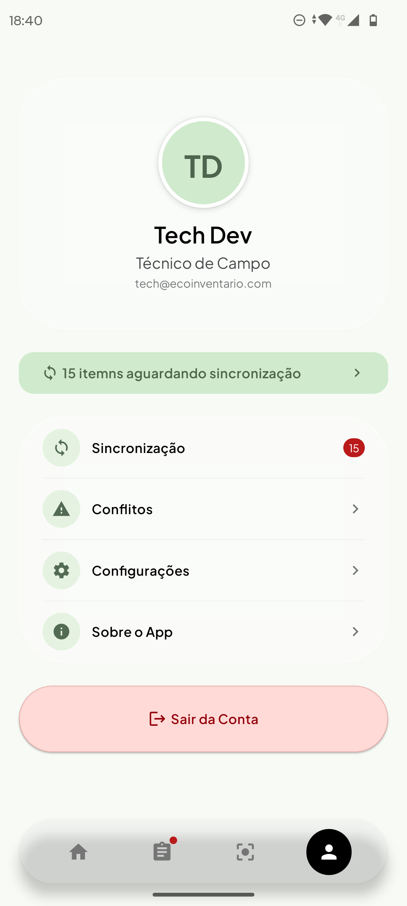

<div align="center">
  

  <h1>EcoInventário</h1>
  <p><strong>Sistema completo de inventário e gestão de ativos ambientais — mobile-first, offline-first.</strong></p>

  <p>
    
    
    
    
    
  </p>

  <p>
    
    
    
  </p>
</div>

---

## 📱 Telas do Aplicativo

<div align="center">
  <table>
    <tr>
      <td align="center">
        
        <br/><sub><b>Boas-Vindas</b></sub>
      </td>
      <td align="center">
        
        <br/><sub><b>Mapa Interativo</b></sub>
      </td>
      <td align="center">
        
        <br/><sub><b>Dashboard Técnico</b></sub>
      </td>
      <td align="center">
        
        <br/><sub><b>Listagem de Ativos</b></sub>
      </td>
    </tr>
    <tr>
      <td align="center">
        
        <br/><sub><b>Detalhes do Ativo</b></sub>
      </td>
      <td align="center">
        
        <br/><sub><b>Registro de Manejo</b></sub>
      </td>
      <td align="center">
        
        <br/><sub><b>Perfil & Sincronização</b></sub>
      </td>
      <td align="center">
        
        <br/><sub><b>Splash Screen</b></sub>
      </td>
    </tr>
  </table>
</div>

---

## 🌿 Sobre o Projeto

O **EcoInventário** é um sistema **full-stack** para gestão de inventários ambientais, desenvolvido para o **Instituto Plantaê**. Permite que técnicos de campo cadastrem, monitorem e gerenciem ativos naturais (árvores, arbustos, espécies nativas) diretamente pelo celular — **com ou sem conexão à internet**.

O sistema foi projetado para operar em ambientes remotos, onde a conectividade é instável, priorizando a experiência offline e sincronizando dados automaticamente quando a conexão é restaurada.

### 🎯 Problema que resolve

Gestores ambientais precisam registrar dados de campo em tempo real, mas nem sempre têm acesso à internet. O EcoInventário garante que **nenhum dado se perde**: o técnico trabalha offline, e o sistema sincroniza tudo em background quando volta a se conectar.

---

## ✨ Funcionalidades

### 👤 Modo Visitante (sem login)
- 🗺️ **Mapa interativo** com todos os ativos da organização
- 🔍 Filtros por tipo de ativo com clustering dinâmico
- 📋 Ficha detalhada de cada ativo
- 📱 Scanner QR Code para identificação rápida

### 🔬 Modo Técnico (autenticado)
- 📊 **Dashboard** com visão geral dos ativos (aprovados, pendentes, rascunhos, rejeitados)
- ➕ **Cadastro de novos ativos** com GPS automático, tipo, notas e fotos
- 📷 **Galeria de fotos** vinculada a cada ativo
- ✂️ **Registro de Manejo** — tipo, data, executor, observações
- 👁️ **Monitoramento** — registro histórico de observações de campo
- 🔍 **Scanner QR profissional** — busca local-first → fallback API
- 🔄 **Status em tempo real** da sincronização (ícone na tab bar)
- ⚠️ **Resolução de conflitos** side-by-side (local vs servidor)
- ⚙️ Perfil, configurações e informações do app

### ☁️ Motor de Sincronização (SyncEngine)
- ⚡ **Offline-first**: todos os dados salvos localmente antes de enviar
- 🔁 **Backoff exponencial** com jitter ±25% para retries resilientes
- 🔒 **Idempotência** via chave única por operação (sem duplicatas)
- 📹 **Fila de mídia** separada para upload de fotos em background
- 🕐 **Polling automático** a cada 30s quando conectado
- 📡 Detecção de conectividade via `@react-native-community/netinfo`

---

## 🏗️ Arquitetura

```
EcoInventario/
├── mobile/                    # App React Native (Expo)
│   ├── app/                   # Rotas (Expo Router file-based)
│   │   ├── (welcome)/         # Tela de boas-vindas
│   │   ├── (guest)/           # Fluxo visitante (mapa, scanner, sobre)
│   │   ├── (auth)/            # Login
│   │   └── (app)/             # Área autenticada
│   │       ├── (home)/        # Dashboard técnico
│   │       ├── (assets)/      # CRUD de ativos
│   │       ├── (scanner)/     # Scanner QR profissional
│   │       └── (profile)/     # Perfil, sync, conflitos, config
│   └── src/
│       ├── sync/              # SyncEngine (singleton, backoff, fila)
│       ├── db/                # SQLite + migrations
│       ├── features/          # Lógica por domínio
│       ├── stores/            # Zustand (auth, sync)
│       ├── components/        # UI reutilizável
│       └── theme/             # Design tokens (colors, typography, spacing)
│
├── cmd/server/                # Entrypoint Go
├── internal/                  # Clean Architecture
│   ├── asset/                 # Domínio de ativos
│   ├── sync/                  # Motor de sync servidor
│   ├── public/                # API pública (visitantes)
│   ├── auth/                  # JWT + RBAC
│   └── media/                 # Upload de mídias
├── migrations/                # Migrações PostgreSQL (golang-migrate)
└── docs/                      # Tasks, regras, arquitetura
```

### Padrões aplicados
- **Clean Architecture** com separação clara por domínio
- **Offline-First** com SQLite local + sync eventual consistente
- **Repository Pattern** tanto no mobile quanto no backend
- **Singleton Pattern** para o `SyncEngine` com controle de estado global
- **RBAC** (Role-Based Access Control): visitante, técnico, admin, aprovador

---

## 🛠️ Stack Tecnológica

### 📱 Mobile
| Tecnologia | Uso |
|---|---|
| **React Native 0.76** | Framework principal |
| **Expo SDK 52** | Build, câmera, localização, splash |
| **Expo Router v4** | Navegação file-based com deep linking |
| **TypeScript** | Tipagem estática completa |
| **expo-sqlite** | Banco local com WAL mode |
| **React Query (TanStack)** | Cache e sincronização de dados remotos |
| **Zustand** | Estado global (auth, sync status) |
| **expo-camera** | Scanner QR Code |
| **react-native-maps** | Mapa interativo com clustering |
| **expo-location** | GPS para registro de ativos |
| **expo-image-picker** | Galeria e câmera para fotos |
| **@expo-google-fonts** | Plus Jakarta Sans (tipografia premium) |

### ⚙️ Backend
| Tecnologia | Uso |
|---|---|
| **Go 1.22** | API REST de alta performance |
| **PostgreSQL + PostGIS** | Banco relacional com suporte geoespacial |
| **golang-migrate** | Migrações versionadas do banco |
| **JWT** | Autenticação stateless |
| **Chi Router** | Roteamento HTTP leve e idiomático |
| **AWS S3 / Cloudflare R2** | Storage de mídias |

---

## 🚀 Como Executar

### Pré-requisitos
- Node.js 20+
- Go 1.22+
- PostgreSQL 15+ com extensão PostGIS
- Expo CLI + development build no dispositivo

### Backend
```bash
# Clone o repositório
git clone https://github.com/Makadeshbr/EcoInventario

# Configure as variáveis de ambiente
cp .env.example .env
# Edite .env com suas credenciais de banco e JWT secret

# Execute as migrações
go run cmd/migrate/main.go up

# Inicie o servidor
go run cmd/server/main.go
```

### Mobile
```bash
cd mobile

# Instale as dependências
npm install

# Configure a URL da API
cp .env.example .env.local
# Edite EXPO_PUBLIC_API_BASE_URL=http://SEU_IP:8080/api/v1/

# Inicie o Metro Bundler
npx expo start --dev-client
```

---

## 🔄 Fluxo de Sincronização

```
[Ação do usuário]
       │
       ▼
[Salva no SQLite local]  ←── Resposta imediata, sem espera de rede
       │
       ▼
[Enfileira na sync_queue]
       │
       ├─── [Online?] ──Yes──▶ [SyncEngine.push()] ──▶ [API Backend]
       │                              │                        │
       │                        [Sucesso]               [Conflito?]
       │                              │                        │
       │                    [marca is_synced=1]     [salva sync_conflicts]
       │                                                       │
       └─── [No] ──▶ [backoff exponencial] ──▶ [retry em 2ˢ×n + jitter]
```

---

## 📐 Design System

O app segue a identidade visual do **Instituto Plantaê**:

- **Paleta**: tons terrosos e verdes naturais (dark green `#102000`, secondary `#4d644d`, cream `#F5F0E8`)
- **Tipografia**: Plus Jakarta Sans (400, 600, 700)
- **Estilo**: Glassmorphism sutil com elevação orgânica, bordas naturais assimétricas
- **Componentização**: Design tokens centralizados em `src/theme/tokens.ts`

---

## 👨‍💻 Sobre o Desenvolvedor

Desenvolvido como projeto portfolio, demonstrando domínio de:

- 📱 Desenvolvimento mobile com React Native / Expo em nível avançado
- ⚙️ Backend em Go com arquitetura limpa e escalável
- 🗄️ Modelagem de banco relacional com suporte geoespacial (PostGIS)
- 🔄 Sincronização offline resiliente com retry inteligente
- 🧱 Aplicação de padrões de engenharia de software (Clean Architecture, Repository, Singleton, RBAC)
- 🎨 UI/UX com foco em experiência premium e design system consistente

---

<div align="center">
  <sub>Feito com 💚 para o Instituto Plantaê · EcoInventário © 2026</sub>
</div>
